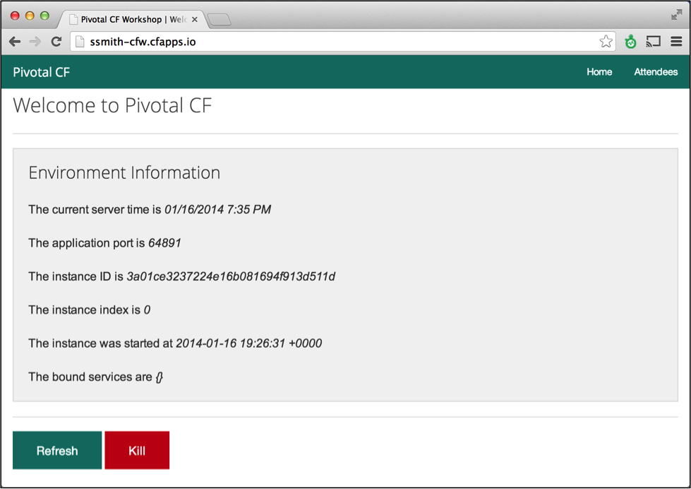
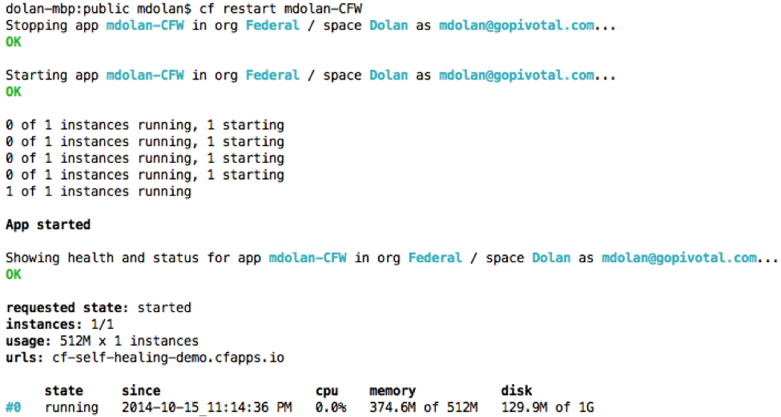
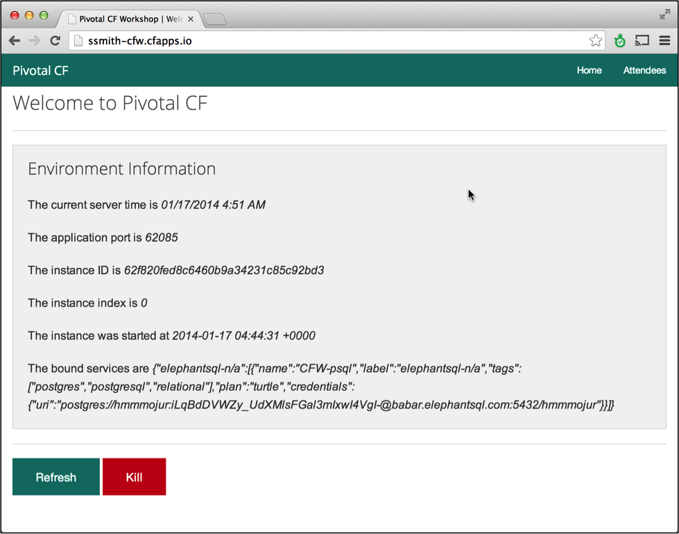

Goals

* Deploy Sample Application

* Access Environmental Variables Page

* Create service

* Bind service

* Start application and use service

Steps

1. Rename the manifest file "manifest.yml" to "new-manifest.yml" (note in Linux the move command “mv” is used to rename files).

* `mv manifest.yml~ new-manifest.yml`

2. Open "new-manifest.yml". Replace "mdolan" with your first initial and last name respectively for both the “name” and “host” configuration entries.

3. Using the CLI push the built application again using the new manifest file created above.

* `cf push <app-name> -f new-manifest.yml`

4. After application deploys and starts open a browser and navigate to the application.  The path to the application is supplied in a message similar to the following: `Push successful! App 'ssmith-CFW' available at ssmith-CFW.cfapps.io`

* Notice the details environment variables
 

5. Get information about deployed app using CLI command

* `cf apps`

6. Use the CLI to list the available services in the marketplace.

* `cf marketplace` or the shortened version `cf m`

7. Create a new database service. Choose the “elephantsql” as the service, “turtle” as the plan and name the Service “CFW-psql”

* `cf create-service elephantsql turtle CFW-psql`

8. Verify the service was created

* `cf services`
 
* You should see the service you just created listed.  It should not be bound to any applications.

9. Bind the service to the deployed application

* `cf bind-service <app_name> CFW-psql`

* `<app_name>` will be the application name returned in step one.

10. Verify the service has been bound to your application.

* `cf services`

* You should now see the service created in step 3 listed.  The bound application column should show your application.

11. Restart the application to utilize the elephantsql service.

* `cf restart <app_name>`

12. After application restarts open a browser and navigate to the application.  The path to the application is supplied in a message similar to the following: urls: ssmith-CFW.cfapps.io

* Notice the environment variables including the details of the bound service.

