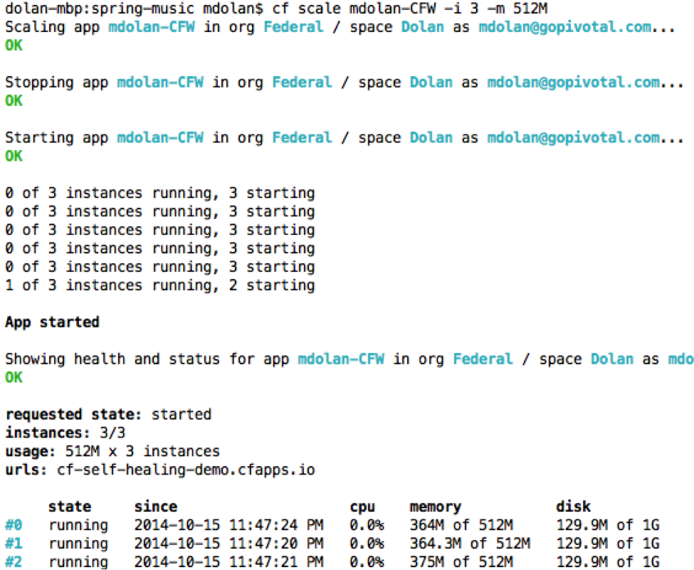
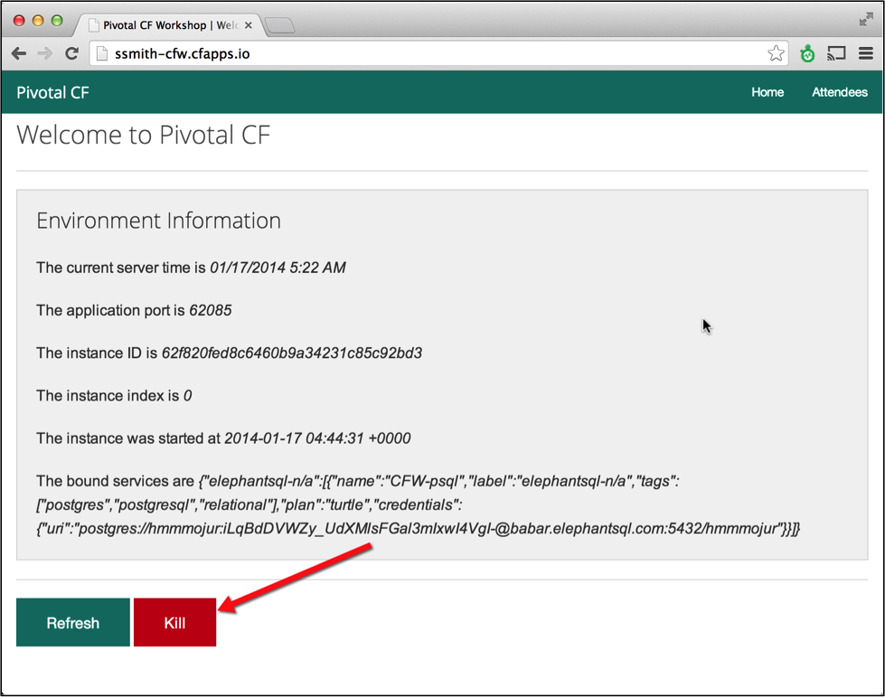
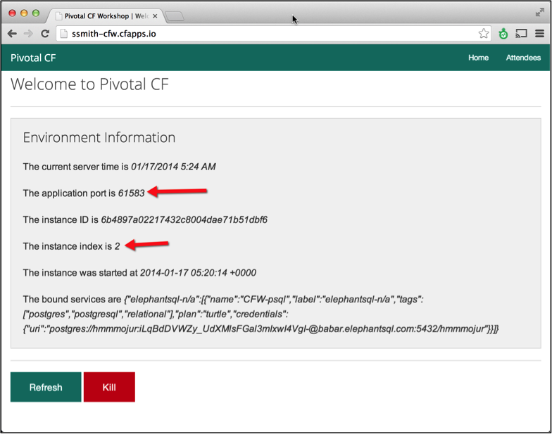

#Scaling Apps with Pivotal Cloud Foundry

Goals

  * Scale deployed application to multiple instances

  * Verify application scaling occurred

Steps

  1. Get information about deployed app using CLI command

    * `cf apps`

    * Note the deployed application URL (should be your first inital and last name e.g “ssmith-CFW.cfapps.io”)

    

  2. Get information about the instances using:

    * `cf app <app_name>`

    * Where `<app_name>` is the sample app name (e.g. ssmith-CFW)

    * You should see only one instance (e.g. instances: 1/1).

    
 
  3. Scale the application to 3 instances (“-i 3”) with 512 MB of RAM (“-m 512M”).   Note that the application will be available and “started” as soon as the first instance is running.  Application status can be monitored via the cf CLI or the web console.

    * `cf scale <app_name>  -i 3 –m 512M`
 
    

  4. Navigate to the app in the browser at http://<first_initial><last_name>-CFW.cfapps.io and click the Kill button

    
 
  5. Reload the app Home Page `http://<<first_initial>><<last_name>>-CFW.cfapps.io`

    * You will notice the application port and index have changed from prior load.  Subsequent refreshes will show that instance index will continue to change.

    

